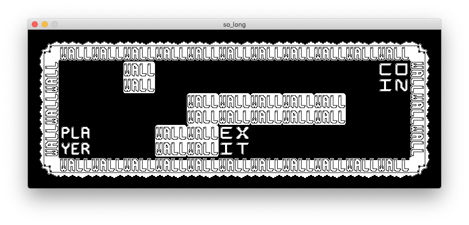

# so_long

This is a GAME ^_^

## Learn minilibX  
[42Paris - minilibx-linux](https://github.com/42Paris/minilibx-linux)

Some better documentation:  
[42 Docs - MiniLibX](https://harm-smits.github.io/42docs/libs/minilibx/getting_started.html)

## Making  
1. Check arguments.
  - If ac < 2 -> error quit.
  - If ac > 2 -> warning (add more options latter?).

2. Check av[1] file type.
  - check if the file name ends with ".ber".

3. Read the map file and store information inside a t_map struct as char ** array.
  ```
  typedef struct s_map
  {
    char **map_tiles;
	t_player player_data;
	t_collect	collect_data;
  } t_map;
  ```

4. Check map validity

5. Run Minilibx, create window, draw images and add event hooks.

And VOILA~~
An ugly but kinda cute WORD GAME ^_^

